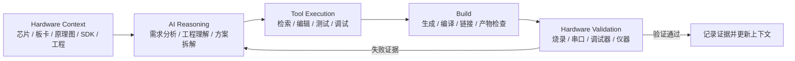

# 个人 Embedded AI 辅助嵌入式研发实践

这是我基于 ESP32、STM32、工业 IoT 等真实开发经历，对 Codex / ChatGPT 辅助研发方式进行抽象、简化和整理后的个人实践总结，内容包括 Agent 规则、Skill 任务模板，以及 Build 与 Hardware Validation 方法。

在实际开发中，我发现 AI 能够帮助梳理需求、阅读工程、生成或修改模块、分析编译错误和整理文档，但它并不天然理解当前板卡、芯片资源、SDK 版本、工程边界和真实设备行为。如果只把任务描述交给 AI，得到的代码即使看起来合理，也可能无法编译、无法运行，甚至对错误的硬件目标执行高风险操作。

这个仓库记录的重点因此不是“AI 生成了多少代码”，而是：

> 如何把嵌入式开发中依赖工程经验的判断，整理成 AI 可以读取、遵守和验证的上下文、规则与流程。

这里不是正式开源框架、商业平台、完整 Agent 系统，也不是承诺长期维护的生产系统或通用解决方案。它是个人真实使用过程中的阶段性方法整理：保留有效的工程约束、任务模板和验证方式，同时明确尚未验证、不可公开或仍需人工判断的边界。

## Background：这些方法来自哪里

这些方法不是从一套预设的 Agent 框架出发，而是来自我在 ESP32-C3/S3、STM32、工业 IoT 边缘网关、CAT1/LoRa 通信设备、CAT1 水表，以及 SDK 与调试工具优化中的实际开发经历。

工业设备中的多协议接入和断链恢复，让我开始显式整理通信分层、状态机和 Recovery 规则；MCU 与水表项目中的 SDK、启动、资源和 BootLoader 差异，让我重视 Hardware Truth 与 Resource Constraint；环境安装、工程模板、编译日志和 FOTA 流程优化，让我把 Workflow、Build Gate 和 Evidence 作为开发效率的一部分；Codex / ChatGPT 的实际使用，则进一步说明 AI 必须结合工程上下文和真实硬件反馈。

上述经历与 `AGENTS.md` 规则的直接映射记录在 [experience-mapping.md](docs/experience-mapping.md)。

### AI 进入真实嵌入式开发流程后遇到的问题

嵌入式开发不是单纯的 C/C++ 编写。一个功能从需求走到设备运行，通常需要经过：

```text
需求与硬件约束
  ↓
Datasheet / Reference Manual / 原理图理解
  ↓
SDK、工具链与工程配置
  ↓
驱动、协议和业务逻辑实现
  ↓
生成、编译与链接
  ↓
烧录与设备运行
  ↓
串口、调试器或仪器反馈
  ↓
问题修复与回归验证
```

我在使用 Codex / ChatGPT 辅助 ESP32、STM32 和工业 IoT 相关开发时，反复遇到四类问题：

- **缺少工程上下文**：AI 不知道目录职责、构建入口、初始化顺序、生成代码边界和既有接口约定；
- **缺少硬件约束**：AI 不知道真实板卡版本、引脚连接、时钟、电压、DMA、外设占用和存储布局；
- **缺少 SDK 版本理解**：同一个 API 名称可能对应不同芯片系列、SDK/HAL 版本和工具链行为；
- **缺少验证闭环**：“代码看起来正确”不等于编译通过，编译通过也不等于真实硬件行为正确。

这些问题说明，AI 辅助嵌入式开发的关键不只是模型能否生成代码，而是能否获得正确上下文、遵守工程边界、调用真实工具，并根据 Build 和 Hardware 证据修正判断。

## 这个仓库展示什么

这个仓库主要展示我如何让 AI 参与嵌入式研发过程：

1. 整理 MCU、板卡、原理图、SDK、工程结构和构建入口；
2. 用硬件事实、资源限制、修改范围和授权边界约束 AI 输出；
3. 将需求拆成可分析、可实现、可验证的开发任务；
4. 让 Codex 在真实工程中辅助代码或脚本实现；
5. 通过编译、串口、调试器和真实硬件反馈完成验证闭环。

## Quick View / Repository Map

Agent、Skill、Workflow 是我对个人开发实践的抽象方式，用于整理约束、任务和流程，不代表一套完整的软件系统。

仓库中的主要文件分别承担不同作用：

| 内容 | 定位 | 解决的问题 |
|---|---|---|
| [AGENTS.md](AGENTS.md) | 个人 AI 辅助嵌入式开发约束规则 | 把硬件事实、资源限制、架构选择、通信可靠性、故障恢复和验证边界写成 Agent 不应绕过的规则 |
| [SKILL.md](SKILL.md) | 个人 AI 辅助开发任务模板 | 按 `Input → Process → Output` 组织工程分析、功能开发、故障定位、驱动开发和 Bring-up 等任务 |
| [`workflows/`](workflows/) | 个人开发流程总结 | 记录需求或问题如何经过分析、实现、工具验证和结果沉淀 |
| [`methodology/`](methodology/) | 方法说明 | 解释硬件上下文、幻觉控制、工程验证和 Developer Experience 背后的判断方法 |
| [`docs/`](docs/) | 规则来源与实践映射 | 记录规则为什么形成，以及经验、规则、工作流和证据之间的对应关系 |

这些内容不是为了构造一个“大而全”的 Agent 产品，而是把已经在开发中形成的 AI 协作方式整理清楚。这里体现的产品思考，是如何把工程经验转化为上下文输入、任务流程、工具边界和验证反馈，而不是声称已经完成一个产品。

## AI 辅助开发的核心闭环



`Hardware Context → AI Reasoning → Tool Execution → Build → Hardware Validation` 是一套实际使用顺序，不是软件系统架构：

1. **Hardware Context**：先明确 MCU、板卡、SDK、工程结构、资源限制和安全边界；无法确认的信息保持未知。
2. **AI Reasoning**：让 AI 基于已有事实拆解需求、分析影响范围，并说明假设、风险和验收条件。
3. **Tool Execution**：让 Codex 阅读真实工程，在允许范围内修改文件，并通过现有工具获得新证据。
4. **Build**：使用项目原生入口执行生成、编译和链接，核对目标、配置、告警和产物身份。
5. **Hardware Validation**：在确认设备与获得操作授权后，通过烧录、串口、J-Link/GDB/OpenOCD 或仪器验证真实行为。

任何阶段出现的新证据都可能推翻前一轮判断。工程师仍然负责确认硬件事实、决定修改边界、批准设备状态变更，并对最终硬件行为负责。

## 为什么需要 Agent 工程约束

工程约束不是一份通用代码规范，也不是某个工具的配置备份。它的作用是告诉 AI：

- 哪些信息可以作为事实，哪些只是推测；
- 哪些修改可以继续，哪些必须先补充上下文；
- 哪些工具可以直接执行，哪些动作需要人工确认；
- 哪些证据只能说明 Build 通过，哪些证据才能说明硬件功能完成。

在真实开发中沉淀出的主要原则包括：

| 原则 | 对 AI 辅助开发的约束 |
|---|---|
| **Hardware truth > software assumption** | 引脚、时钟、电压、DMA、寄存器和存储布局必须有 Datasheet、原理图、工程配置或测量依据 |
| **Deterministic behavior > flexibility** | 实时路径优先有界执行、明确超时和可预测资源占用 |
| **Explicit state machine > implicit logic** | 生命周期、通信和恢复过程使用明确状态、事件、超时和失败路径 |
| **Static memory > dynamic allocation** | 资源受限或确定性路径优先静态、定长和所有权清晰的内存设计 |
| **Minimal architecture > feature richness** | 根据资源与并发需求选择足够的执行模型，不为了形式增加 RTOS 或抽象层 |
| **Build result ≠ Hardware validation** | 编译通过不能证明引脚、电气、时序、协议和设备行为正确 |
| **Evidence > plausible explanation** | 工具输出、构建产物、设备日志和测量结果优先于自然语言推断 |

完整规则见 [AGENTS.md](AGENTS.md)。规则来源和设计考虑分别记录在 [origin-of-rules.md](docs/origin-of-rules.md) 与 [design-philosophy.md](docs/design-philosophy.md)。

## 我实际使用 Codex / ChatGPT 的方式

在一些 ESP32、STM32 项目中，我采用的基本流程是：

1. 先整理硬件框架、原理图相关信息、MCU 与外设连接、SDK 版本和现有工程结构；
2. 使用 ChatGPT 将原始目标整理为可审查的需求，包括功能逻辑、软件结构、状态转换、约束、异常路径和验收条件；
3. 人工检查并修改需求，确认哪些是已知事实、哪些需要验证、哪些不属于本次范围；
4. 将需求文档和真实工程交给 Codex，让它先阅读目录、构建文件和既有接口，再形成修改计划；
5. 由 Codex 在受控范围内完成代码或脚本修改，并执行当前项目可用的构建与检查命令；
6. 在设备和权限明确时，通过串口、J-Link 或其他调试工具采集真实反馈；
7. 根据编译结果、日志和设备现象继续修正，最后把经过验证的约束沉淀回项目上下文。

对于 ESP32 等重复使用的工程模式，我还会把经过验证的通用规则整理成 Agent 说明或任务模板，放入新项目中作为起始上下文。这样做不是让 AI 完全自动开发，而是减少每次重新解释工程边界的成本，并降低 AI 在芯片、SDK 和项目结构上的无依据猜测。

## 从真实经验到规则

仓库遵循的整理路径是：

```text
真实工程问题
  ↓
可复用的工程判断
  ↓
Agent 约束或 Skill 模板
  ↓
Workflow 与工具检查
  ↓
可追溯的 Build / Hardware 证据
```

例如：

- 工业 IoT 项目中的多设备、多协议和断链恢复问题，形成通信分层、显式状态机和有界恢复规则；
- MCU 平台适配中的 SDK 差异、资源限制和底层能力缺口，形成 Hardware Truth、Resource Classification 和静态设计规则；
- SDK 与调试工具优化中的环境配置、模板创建、编译日志和 FOTA 操作摩擦，形成 Workflow、Build Gate 和 Evidence 规则；
- AI Coding 实践中出现的上下文缺失和“编译通过即完成”误判，形成工程读取、工具调用、Build 与 Hardware 分级验证要求。

个人经历到规则的一页式索引见 [experience-mapping.md](docs/experience-mapping.md)，更通用的 Agent 行为映射见 [mapping-to-practice.md](docs/mapping-to-practice.md)。

## 仓库结构

```text
.
├─ README.md                         # 技术实践背景、核心闭环与阅读入口
├─ AGENTS.md                         # 个人 AI 辅助嵌入式开发约束规则
├─ SKILL.md                          # 个人 AI 辅助开发任务模板
├─ agents/
│  └─ openai.yaml                   # Skill 元数据与调用入口
├─ docs/
│  ├─ origin-of-rules.md            # 工程经验与规则来源
│  ├─ experience-mapping.md          # 个人项目经验到 AGENTS 规则的直接映射
│  ├─ design-philosophy.md           # 约束、权限和验证的设计考虑
│  └─ mapping-to-practice.md         # 经验、规则、流程与证据映射
├─ workflows/
│  ├─ feature-development.md        # 个人功能开发流程总结
│  ├─ bug-analysis.md               # 个人故障分析与修复流程总结
│  ├─ driver-development.md         # 个人驱动开发与外设验证流程总结
│  ├─ hardware-bringup.md           # 个人 MCU / 板卡 Bring-up 流程总结
│  └─ context-maintenance.md        # 个人上下文维护流程总结
├─ methodology/
│  ├─ hardware-context.md           # 硬件与工程上下文整理方法
│  ├─ ai-hallucination-control.md   # 无依据推断与版本错配控制
│  ├─ engineering-validation.md     # 从静态检查到真机验证
│  └─ developer-experience.md       # 开发流程摩擦与工具价值
└─ references/
   ├─ engineering-lessons.md        # 通用工程经验
   ├─ project-context.md            # 经验来源与真实性边界
   ├─ evidence-record.md            # 工具与验证证据记录方式
   ├─ tool-contracts.md             # 构建、烧录、串口和调试工具约定
   └─ verification-checklist.md      # 完成前验证清单
```

## 如何参考这些内容

一次具体任务可以按以下顺序使用仓库中的材料：

1. 按 [hardware-context.md](methodology/hardware-context.md) 收集当前项目的事实、来源和未知项；
2. 根据任务类型参考 `workflows/` 中对应流程；
3. 使用 [SKILL.md](SKILL.md) 的 `Input → Process → Output` 模板明确目标、非目标、允许修改范围和验收条件；
4. 让 Codex 先阅读工程，再执行一次最小、受控、可验证的分析或修改；
5. 分别记录构建证据和硬件证据，无法执行时如实说明；
6. 仅将已经验证、且对后续任务仍适用的约束写回上下文。

这些步骤可以按实际项目裁剪。它们提供的是检查思路和任务模板，不要求项目接入某个统一运行时，也不假设 AI 能够替代工程师完成全部判断。

## 结果与证据边界

仓库将构建结果和硬件结果分开记录：

- `BUILD PASSED` / `BUILD FAILED` / `BUILD NOT RUN`
- `HARDWARE PASSED` / `HARDWARE FAILED` / `HARDWARE NOT RUN`

构建、主机测试、仿真和静态检查都不能替代 `HARDWARE PASSED`。没有执行的命令不生成占位日志；没有测量的数据不填写效率比例、稳定性结论或硬件结果。

仓库不依靠大量示例项目或 Demo 代码证明方法有效。每次任务是否成立，仍以真实工程中的构建、日志、调试器和硬件证据为准。

## 真实性与范围

这些内容来自工业 IoT、CAT1/LoRa 通信设备、国产 MCU 适配、传感器采集、SDK 与调试工具优化，以及 ESP32、STM32 项目中出现过的问题。仓库只保留可复用、可公开的工程认知：

- 不复制公司或客户代码、原理图、协议细节和生产日志；
- 不包含客户身份、商业数据、凭据、私有地址或设备标识；
- 不虚构项目、执行结果、效率数字或硬件验证记录；
- AI 工具只指实际使用的 Codex 和 ChatGPT；
- 不把这份阶段性技术总结表述为商业平台、成熟开源框架或生产级 Agent 系统。

这份实践总结最终关注的是一件事：把真实嵌入式研发中的上下文、约束和验证经验结构化，让 AI 能够更可靠地参与需求理解、工程分析、代码修改、构建和硬件问题闭环，同时让最终判断始终回到工程师和可追溯证据。它展示的是已经形成的 AI 协作方式，以及把工程经验转化为产品问题和流程判断的能力，而不是一个完整产品或通用方案。
